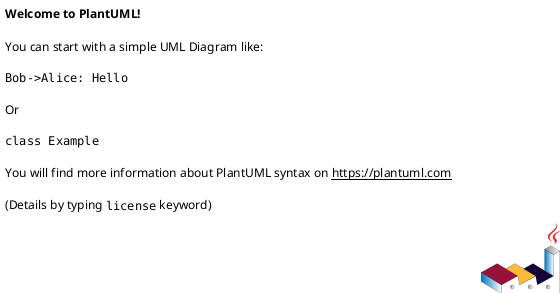
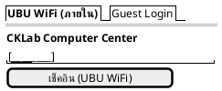
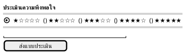
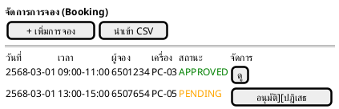
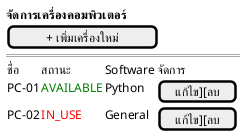
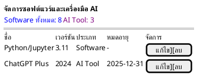
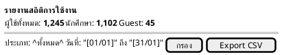
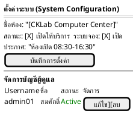

# บทที่ 3 การออกแบบระบบ

## **3.1 สถาปัตยกรรมระบบ (System Architecture)**

ระบบ CKLab Management System ได้รับการพัฒนาบนพื้นฐานของ **Django Framework** ซึ่งใช้สถาปัตยกรรม **MVT (Model-View-Template)** โดยแยกความรับผิดชอบออกเป็น 3 ชั้น ดังนี้

| ชั้น | บทบาท | เทคโนโลยี |
| :--- | :--- | :--- |
| **Model** | จัดการข้อมูลและการสื่อสารกับฐานข้อมูล | Django ORM + PostgreSQL 15 |
| **View** | ประมวลผล Business Logic และตอบสนองคำขอ | Django Class-Based Views (CBV) |
| **Template** | แสดงผล UI และรับ Input จากผู้ใช้ | HTML + Bootstrap 5.3 + JavaScript |

### 3.1.1 ภาพรวมสถาปัตยกรรม

ระบบแบ่งออกเป็น 2 ส่วนหลักตามกลุ่มผู้ใช้งาน คือ **Kiosk** สำหรับผู้ใช้งานทั่วไป (Public, ไม่ต้องล็อกอิน) และ **Admin Portal** สำหรับผู้ดูแลระบบ (ต้องล็อกอิน) โดยทั้งสองส่วนใช้ฐานข้อมูล PostgreSQL ร่วมกัน และ Kiosk มีการเชื่อมต่อ UBU External API เพิ่มเติมสำหรับยืนยันตัวตน



*รูปที่ 3.1 สถาปัตยกรรมระบบ CKLab ในรูปแบบ MVT Pattern ของ Django Framework แสดงการไหลของข้อมูลระหว่าง Client Browser, Django Views, Models, PostgreSQL และ UBU External API (สัมพันธ์กับสไลด์นำเสนอหน้าที่แสดง System Architecture Overview)*

### 3.1.2 การแบ่ง Module ตามความรับผิดชอบ

Views Layer แบ่งออกเป็น 8 Module ตามฟังก์ชันการทำงาน ดังนี้

| Module (ไฟล์) | จำนวน View | หน้าที่รับผิดชอบ |
| :--- | :---: | :--- |
| `lab_management/views/auth.py` | 2 | Login, Logout สำหรับ Admin |
| `lab_management/views/kiosk.py` | 5 | Check-in, Check-out, Timer, Feedback, UBU API |
| `lab_management/views/monitor.py` | 4 | Monitor Dashboard, Real-time API, Force Check-in/out |
| `lab_management/views/booking.py` | 5 | Booking CRUD, CSV Import, Status Update API |
| `lab_management/views/manage_pc.py` | 4 | PC เพิ่ม/แก้ไข/ลบ |
| `lab_management/views/software.py` | 3 | Software เพิ่ม/แก้ไข/ลบ |
| `lab_management/views/report.py` | 3 | Report, Export CSV, Import Log |
| `lab_management/views/config.py` | 4 | System Config, User CRUD |

### 3.1.3 การเชื่อมต่อ UBU External API

ระบบเชื่อมต่อกับ UBU API ของมหาวิทยาลัยอุบลราชธานีเพื่อยืนยันตัวตนผู้ใช้งานภายใน โดยมีรายละเอียดดังนี้

| รายการ | รายละเอียด |
| :--- | :--- |
| **Endpoint** | `https://esapi.ubu.ac.th/api/v1/student/reg-data` |
| **Method** | POST |
| **Encoding** | รหัส UBU WiFi เข้ารหัสด้วย Base64 ก่อนส่ง |
| **Response** | ชื่อ, นามสกุล, คณะ, ชั้นปี, ระดับการศึกษา |
| **Role Detection** | ตรวจสอบ prefix (อาจารย์, ดร., ผศ., รศ.) เพื่อแยก staff / student |
| **Error Handling** | แสดงข้อความแจ้งเตือนภาษาไทยเมื่อ API ไม่ตอบสนอง |

---

## **3.2 ข้อมูลที่เกี่ยวข้องกับระบบ**

### 3.2.1 Entity-Relationship Diagram (ERD)

ระบบ CKLab ใช้ฐานข้อมูล PostgreSQL 15 ประกอบด้วย 6 Entity หลัก ดังนี้


*รูปที่ 3.2 Entity-Relationship Diagram แสดงความสัมพันธ์ระหว่าง 6 ตารางในฐานข้อมูลของระบบ CKLab (สัมพันธ์กับสไลด์นำเสนอหน้าที่แสดง Database Design / ERD)*

### 3.2.2 Data Dictionary

#### ตาราง SiteConfig (การตั้งค่าระบบ)

| Field | Type | Constraint | คำอธิบาย |
| :--- | :--- | :--- | :--- |
| id | Integer | PK, Auto | รหัสหลัก |
| lab_name | CharField(100) | NOT NULL | ชื่อห้องปฏิบัติการ |
| location | CharField(200) | NOT NULL | สถานที่ตั้ง |
| is_open | BooleanField | Default=True | สถานะเปิด/ปิดบริการ |
| booking_enabled | BooleanField | Default=True | เปิด/ปิดระบบจอง |
| announcement | TextField | Blank | ข้อความประกาศ |
| admin_on_duty | FK(AdminonDuty) | Nullable | ผู้ดูแลที่ล็อกอินอยู่ |

#### ตาราง AdminonDuty (ผู้ดูแลระบบประจำวัน)

| Field | Type | Constraint | คำอธิบาย |
| :--- | :--- | :--- | :--- |
| id | Integer | PK, Auto | รหัสหลัก |
| admin_on_duty | CharField(100) | NOT NULL | ชื่อผู้ดูแล |
| contact_email | EmailField | NOT NULL | อีเมลติดต่อ |
| contact_phone | CharField(20) | NOT NULL | เบอร์โทรติดต่อ |

#### ตาราง Computer (เครื่องคอมพิวเตอร์)

| Field | Type | Constraint | คำอธิบาย |
| :--- | :--- | :--- | :--- |
| id | Integer | PK, Auto | รหัสหลัก |
| name | CharField(20) | NOT NULL, Unique | ชื่อเครื่อง เช่น PC-01 |
| status | CharField | NOT NULL | AVAILABLE / IN_USE / RESERVED / MAINTENANCE |
| description | TextField | Nullable | รายละเอียดเพิ่มเติม |
| last_updated | DateTimeField | Auto | เวลาที่อัปเดตสถานะล่าสุด |
| Software | FK(Software) | Nullable | ซอฟต์แวร์ประจำเครื่อง |

#### ตาราง Software (ซอฟต์แวร์และเครื่องมือ AI)

| Field | Type | Constraint | คำอธิบาย |
| :--- | :--- | :--- | :--- |
| id | Integer | PK, Auto | รหัสหลัก |
| name | CharField(100) | NOT NULL | ชื่อซอฟต์แวร์ |
| version | CharField(100) | NOT NULL | เวอร์ชัน |
| type | CharField | NOT NULL | Software / AI Tool |
| expire_date | DateField | Nullable | วันหมดอายุสัญญาอนุญาต |

#### ตาราง Booking (การจองล่วงหน้า)

| Field | Type | Constraint | คำอธิบาย |
| :--- | :--- | :--- | :--- |
| id | Integer | PK, Auto | รหัสหลัก |
| student_id | CharField(20) | NOT NULL | รหัสผู้จอง |
| computer | FK(Computer) | NOT NULL | เครื่องที่จอง |
| start_time | DateTimeField | NOT NULL | เวลาเริ่มต้นการจอง |
| end_time | DateTimeField | NOT NULL | เวลาสิ้นสุดการจอง |
| booking_date | DateTimeField | Auto | วันที่สร้างการจอง |
| status | CharField | NOT NULL | PENDING / APPROVED / REJECTED |
| created_at | DateTimeField | Auto | timestamp การสร้าง |

#### ตาราง UsageLog (บันทึกการใช้งาน)

| Field | Type | Constraint | คำอธิบาย |
| :--- | :--- | :--- | :--- |
| id | Integer | PK, Auto | รหัสหลัก |
| user_id | CharField(50) | NOT NULL | รหัสผู้ใช้ |
| user_name | CharField(100) | NOT NULL | ชื่อ-สกุลผู้ใช้ |
| user_type | CharField | NOT NULL | student / staff / guest |
| department | CharField(100) | Blank | คณะ/หน่วยงาน |
| user_year | CharField(10) | Blank | ชั้นปี |
| computer | CharField(20) | NOT NULL | ชื่อเครื่อง (snapshot) |
| Software | CharField(100) | Blank | ชื่อซอฟต์แวร์ (snapshot) |
| start_time | DateTimeField | Auto | เวลา Check-in |
| end_time | DateTimeField | Nullable | เวลา Check-out (null = ยังใช้งานอยู่) |
| satisfaction_score | IntegerField | Nullable, 1-5 | คะแนนความพึงพอใจ |
| comment | CharField(500) | Blank | ข้อเสนอแนะ |

> **หมายเหตุ:** ฟิลด์ `computer` และ `Software` ใน UsageLog เป็น CharField ไม่ใช่ Foreign Key เพื่อรักษาประวัติการใช้งานแม้ว่าเครื่องหรือซอฟต์แวร์นั้นจะถูกลบออกจากระบบภายหลัง

---

## **3.3 การออกแบบ URL / API Endpoints**

### 3.3.1 URL Pattern ของ Kiosk (Public — ไม่ต้องล็อกอิน)

| Method | URL Pattern | View Class | คำอธิบาย |
| :---: | :--- | :--- | :--- |
| GET | `/` | `IndexView` | หน้าหลัก Kiosk แสดงฟอร์ม Check-in |
| POST | `/api/verify-user/` | `VerifyUserAPIView` | ยืนยันตัวตนผ่าน UBU API (JSON) |
| GET | `/status/<pc_id>/` | `StatusView` | ตรวจสอบสถานะเครื่อง (JSON) |
| POST | `/checkin/<pc_id>/` | `CheckinView` | บันทึก Check-in และสร้าง UsageLog |
| GET | `/checkout/<pc_id>/` | `CheckoutView` | บันทึก Check-out และปิด UsageLog |
| POST | `/feedback/<pc_id>/<log_id>/` | `FeedbackView` | บันทึก Feedback ลงใน UsageLog |

### 3.3.2 URL Pattern ของ Admin Portal (ต้องล็อกอิน — LoginRequiredMixin)

**Authentication:**

| Method | URL Pattern | View Class | คำอธิบาย |
| :---: | :--- | :--- | :--- |
| GET/POST | `/admin-portal/login/` | `LoginView` | หน้าล็อกอิน Admin |
| GET | `/admin-portal/logout/` | `LogoutView` | ล็อกเอาท์และล้าง admin_on_duty |

**Monitor Dashboard:**

| Method | URL Pattern | View Class | คำอธิบาย |
| :---: | :--- | :--- | :--- |
| GET | `/admin-portal/monitor/` | `AdminMonitorView` | หน้า Monitor Dashboard (HTML) |
| GET | `/admin-portal/api/monitor/data/` | `AdminMonitorDataAPIView` | ข้อมูลสถานะเครื่องแบบ Real-time (JSON) |
| POST | `/admin-portal/checkin/<pc_id>/` | `AdminCheckinView` | Force Check-in แทนผู้ใช้ |
| POST | `/admin-portal/checkout/<pc_id>/` | `AdminCheckoutView` | Force Check-out แทนผู้ใช้ |

**Booking:**

| Method | URL Pattern | View Class | คำอธิบาย |
| :---: | :--- | :--- | :--- |
| GET | `/admin-portal/booking/` | `AdminBookingView` | รายการ Booking ทั้งหมด |
| GET/POST | `/admin-portal/booking/import/` | `AdminImportBookingView` | นำเข้า Booking จาก CSV |
| GET/POST | `/admin-portal/booking/<id>/` | `AdminBookingDetailView` | ดู/แก้ไข Booking รายการเดียว |
| GET | `/admin-portal/api/bookings/data/` | `AdminBookingDataAPIView` | ข้อมูล Booking (JSON) |
| POST | `/admin-portal/api/bookings/add/` | `AdminBookingAddAPIView` | สร้าง Booking ใหม่ (JSON) |
| POST | `/admin-portal/api/bookings/<id>/status/` | `AdminBookingStatusAPIView` | อัปเดตสถานะ Booking (JSON) |

**PC Management:**

| Method | URL Pattern | View Class | คำอธิบาย |
| :---: | :--- | :--- | :--- |
| GET | `/admin-portal/manage-pc/` | `AdminManagePcView` | รายการ PC ทั้งหมด |
| POST | `/admin-portal/manage-pc/add/` | `AdminAddPcView` | เพิ่ม PC ใหม่ |
| POST | `/admin-portal/manage-pc/<id>/edit/` | `AdminManagePcEditView` | แก้ไข PC |
| POST | `/admin-portal/manage-pc/<id>/delete/` | `AdminManagePcDeleteView` | ลบ PC |

**Software, Report, Config, Users:**

| Method | URL Pattern | View Class | คำอธิบาย |
| :---: | :--- | :--- | :--- |
| GET/POST | `/admin-portal/software/` | `AdminSoftwareView` | รายการ Software ทั้งหมด + เพิ่มใหม่ |
| GET/POST | `/admin-portal/software/<id>/edit/` | `AdminSoftwareEditView` | แก้ไข Software |
| POST | `/admin-portal/software/<id>/delete/` | `AdminSoftwareDeleteView` | ลบ Software |
| GET/POST | `/admin-portal/report/` | `AdminReportView` | รายงานพร้อมตัวกรอง |
| GET | `/admin-portal/report/api/logs/` | `AdminReportAPIView` | ข้อมูล UsageLog ทั้งหมด (JSON) |
| GET | `/admin-portal/report/export/` | `AdminReportExportView` | ส่งออก CSV |
| GET/POST | `/admin-portal/config/` | `AdminConfigView` | ตั้งค่าระบบ |
| GET/POST | `/admin-portal/users/` | `AdminUserView` | จัดการบัญชีผู้ดูแล |
| GET/POST | `/admin-portal/users/<id>/edit/` | `AdminUserEditView` | แก้ไขบัญชีผู้ดูแล |
| POST | `/admin-portal/users/<id>/delete/` | `AdminUserDeleteView` | ลบบัญชีผู้ดูแล |

---

## **3.4 การออกแบบส่วนติดต่อผู้ใช้ (UI/UX Design)**

ระบบใช้ **Bootstrap 5.3** และฟอนต์ **Kanit** (Google Fonts) เพื่อรองรับภาษาไทย ออกแบบให้ Responsive รองรับหน้าจอขนาดต่าง ๆ โดยแบ่งการออกแบบออกเป็น 2 ส่วนหลัก

### 3.4.1 หน้า Kiosk หลัก (Check-in)

หน้าหลักของ Kiosk แสดงแบบฟอร์ม Check-in แบ่งเป็น 2 Tab คือ UBU WiFi (สำหรับผู้ใช้ภายใน) และ Guest Login (สำหรับบุคคลภายนอก) พร้อมแสดงข้อมูลผู้ดูแลระบบประจำวัน



*รูปที่ 3.3 Wireframe หน้าจอ Kiosk หลักสำหรับ Check-in แสดง 2 โหมด: UBU WiFi (Internal) และ Guest Login (สัมพันธ์กับสไลด์นำเสนอหน้าที่แสดงหน้าจอ Kiosk Check-in)*

### 3.4.2 หน้า Timer / Session Status

หน้าแสดงเวลาการใช้งานสะสมแบบเรียลไทม์ หลังจาก Check-in สำเร็จ แสดงชื่อผู้ใช้ คณะ และซอฟต์แวร์ที่ใช้งาน พร้อมปุ่ม Check-out

```plantuml
' render จาก Docs/ch3/fig3_4.puml
@startuml
salt
{
  { <b>CKLab</b> | . | <b>PC-01</b> }
  ==
  ยินดีต้อนรับ <b>นายสมชาย ใจดี</b>
  ==
  " 00 : 42 : 17 "
  [ เช็คเอาท์ ]
}
@enduml
```



*รูปที่ 3.4 Wireframe หน้าจอ Timer แสดงเวลาใช้งานสะสมแบบเรียลไทม์ (HH:MM:SS) JavaScript อัปเดตทุก 1 วินาที (สัมพันธ์กับสไลด์นำเสนอหน้าที่แสดงหน้าจอ Session Timer)*

### 3.4.3 หน้า Feedback

หน้าแบบประเมินความพึงพอใจแสดงหลัง Check-out คะแนน 1-5 ดาวเป็นช่องบังคับ ข้อเสนอแนะเป็นตัวเลือก



*รูปที่ 3.5 Wireframe หน้าจอ Feedback แบบประเมินความพึงพอใจ 1–5 ดาว satisfaction_score เป็น field บังคับ comment เป็น field ไม่บังคับ (สัมพันธ์กับสไลด์นำเสนอหน้าที่แสดงหน้าจอ Feedback)*

### 3.4.4 หน้า Admin Monitor Dashboard

หน้าหลักของ Admin Portal แสดงสถานะเครื่องคอมพิวเตอร์ทุกเครื่องแบบ Real-time ผ่าน AJAX Polling และสถิติสรุป

```plantuml
' render จาก Docs/ch3/fig3_6.puml
@startuml
salt
{
  { [Monitor] | [Booking] | [Manage PC] | [Software] | [Report] | [Config] }
  ==
  { <color:green>ว่าง: 12</color> | <color:red>ใช้งาน: 5</color> | <color:orange>จอง: 2</color> | <color:gray>แจ้งซ่อม: 1</color> }
  ==
  { <color:red>[PC-01] นายสมชาย 00:42 [Force Logout]</color> |
    <color:green>[PC-02] ว่าง [Check-in]</color> }
}
@enduml
```



*รูปที่ 3.6 Wireframe หน้าจอ Monitor Dashboard แสดงการ์ดสถานะเครื่องคอมพิวเตอร์แบบ Real-time พร้อม Summary Cards และปุ่ม Force Check-in/Logout (สัมพันธ์กับสไลด์นำเสนอหน้าที่แสดง Admin Monitor Dashboard)*

### 3.4.5 หน้า Booking Management

หน้าจัดการการจองเครื่องล่วงหน้า แสดงรายการ Booking ทั้งหมดพร้อม Workflow การอนุมัติ และรองรับการนำเข้าจาก CSV



*รูปที่ 3.7 Wireframe หน้าจอ Booking Management แสดงรายการการจองพร้อม Workflow PENDING → APPROVED / REJECTED (สัมพันธ์กับสไลด์นำเสนอหน้าที่แสดง Booking System)*

### 3.4.6 หน้า Manage PC

หน้าจัดการข้อมูลเครื่องคอมพิวเตอร์ รองรับการเพิ่ม แก้ไข ลบ และกำหนดสถานะ/ซอฟต์แวร์ประจำเครื่อง



*รูปที่ 3.8 Wireframe หน้าจอ Manage PC แสดงรายการเครื่องพร้อม Status Badge และปุ่มแก้ไข/ลบ ฟอร์มเพิ่ม/แก้ไขมีการตรวจสอบชื่อซ้ำ (สัมพันธ์กับสไลด์นำเสนอหน้าที่แสดง PC Management)*

### 3.4.7 หน้า Software Management

หน้าจัดการรายการซอฟต์แวร์และเครื่องมือ AI แยกประเภทระหว่าง Software ทั่วไปและ AI Tool



*รูปที่ 3.9 Wireframe หน้าจอ Software Management แสดงสถิติจำนวน Software / AI Tool และตารางรายการพร้อมวันหมดอายุ (สัมพันธ์กับสไลด์นำเสนอหน้าที่แสดง Software Management)*

### 3.4.8 หน้า Reports & Analytics

หน้ารายงานสถิติการใช้งาน รองรับการกรองตามประเภทผู้ใช้ ช่วงวันที่ และโหมดรายงาน พร้อม Export CSV



*รูปที่ 3.10 Wireframe หน้าจอ Reports & Analytics แสดง Summary Cards และตัวกรองข้อมูล รองรับ Export CSV แบบ UTF-8 BOM สำหรับ Excel ภาษาไทย (สัมพันธ์กับสไลด์นำเสนอหน้าที่แสดง Reports)*

### 3.4.9 หน้า System Configuration

หน้าตั้งค่าระบบและจัดการบัญชีผู้ดูแลระบบ รวมไว้ในหน้าเดียว



*รูปที่ 3.11 Wireframe หน้าจอ System Configuration รวมการตั้งค่าห้อง สถานะบริการ ประกาศ และการจัดการบัญชีผู้ดูแลไว้ในหน้าเดียว (สัมพันธ์กับสไลด์นำเสนอหน้าที่แสดง System Config)*

---

## **3.5 Activity Diagram**

Activity Diagram แสดงกระบวนการทำงานหลักของระบบ ครอบคลุม 4 กระบวนการสำคัญ

### 3.5.1 กระบวนการ Check-in ด้วยรหัส UBU WiFi

กระบวนการ Check-in เริ่มตั้งแต่การกรอกรหัส UBU WiFi ผ่านการยืนยันตัวตน UBU API จนถึงการสร้าง UsageLog และแสดงหน้า Timer รวมถึงการจัดการ Ghost State (เครื่องค้างสถานะโดยไม่มีเซสชัน)

```plantuml
' render จาก Docs/ch3/fig3_12.puml
' [Activity Diagram: Check-in UBU WiFi Flow]
' ดูไฟล์ fig3_12.puml สำหรับ diagram แบบเต็ม
```

*รูปที่ 3.12 Activity Diagram แสดงกระบวนการ Check-in ด้วยรหัส UBU WiFi ครอบคลุมการยืนยันตัวตนผ่าน UBU API และการจัดการ Ghost State (สัมพันธ์กับสไลด์นำเสนอหน้าที่แสดง Check-in Flow)*

### 3.5.2 กระบวนการ Check-out และการเก็บ Feedback

กระบวนการ Check-out บันทึก end_time ลงใน UsageLog และเปลี่ยนสถานะเครื่องกลับเป็น AVAILABLE จากนั้น redirect ไปยังหน้า Feedback เพื่อเก็บคะแนนความพึงพอใจ

```plantuml
' render จาก Docs/ch3/fig3_13.puml
' [Activity Diagram: Check-out + Feedback Flow]
' ดูไฟล์ fig3_13.puml สำหรับ diagram แบบเต็ม
```

*รูปที่ 3.13 Activity Diagram แสดงกระบวนการ Check-out และการเก็บ Feedback รวมถึงการจัดการ Ghost State กรณีไม่พบ UsageLog ที่ active (สัมพันธ์กับสไลด์นำเสนอหน้าที่แสดง Check-out Flow)*

### 3.5.3 กระบวนการจองเครื่องคอมพิวเตอร์ล่วงหน้า (Booking)

กระบวนการ Booking เริ่มจาก Admin สร้างการจอง ระบบตรวจสอบความถูกต้อง บันทึก Booking สถานะ PENDING จากนั้น Admin อนุมัติหรือปฏิเสธ รวมถึงกระบวนการ Import จาก CSV

```plantuml
' render จาก Docs/ch3/fig3_14.puml
' [Activity Diagram: Booking Flow]
' ดูไฟล์ fig3_14.puml สำหรับ diagram แบบเต็ม
```

*รูปที่ 3.14 Activity Diagram แสดงกระบวนการจองเครื่องคอมพิวเตอร์ล่วงหน้า ตั้งแต่การสร้าง Booking (PENDING) จนถึงการอนุมัติ (APPROVED) และการ Import จาก CSV (สัมพันธ์กับสไลด์นำเสนอหน้าที่แสดง Booking Flow)*

### 3.5.4 กระบวนการอัปเดต Monitor Dashboard แบบเรียลไทม์

Monitor Dashboard ใช้ AJAX Polling ส่ง Request ทุก 3 วินาทีไปยัง REST API Endpoint เพื่อรับข้อมูลสถานะเครื่องทุกเครื่องและอัปเดต DOM โดยไม่ต้อง Refresh หน้าเว็บ

```plantuml
' render จาก Docs/ch3/fig3_15.puml
' [Activity Diagram: Monitor Real-time AJAX Polling]
' ดูไฟล์ fig3_15.puml สำหรับ diagram แบบเต็ม
```

*รูปที่ 3.15 Activity Diagram แสดงกระบวนการอัปเดต Monitor Dashboard แบบเรียลไทม์ผ่าน AJAX Polling ทุก 3 วินาที โดย JavaScript อัปเดต DOM เฉพาะเมื่อข้อมูลเปลี่ยนแปลง (สัมพันธ์กับสไลด์นำเสนอหน้าที่แสดง Real-time Monitor Flow)*
